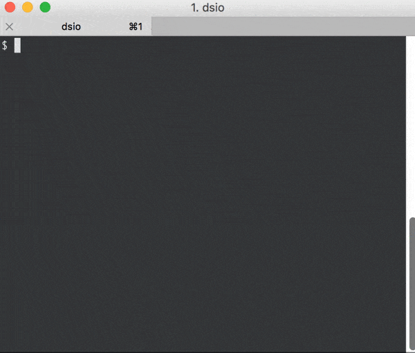

# dsio

`dsio` is a command line tool for [Google Cloud Datastore](https://cloud.google.com/datastore/). 
As this tool is under development, please use this tool in your own risk. 
And any issue requests and bug reports are welcome :) 

### Features
- Bulk upsert entities to Datastore
- Query entities by GQL from Datastore




# Getting Started
### Installation
```
go get -u github.com/nshmura/dsio
```


### Authentication
1. Create [service account](https://cloud.google.com/iam/docs/managing-service-account-keys), and download a JSON file that contains the private key. 
2. Set `DSIO_KEY_FILE` and `DSIO_PROJECT_ID` environment variables. like this:
```
export DSIO_KEY_FILE=/path/to/service_account_file.json
export DSIO_PROJECT_ID=your-gcp-project-id
```

Or set `key-file` option and `project-id` option. <br>
like below `import` command:
```
$ dsio upsert --key-file /path/to/service_account_file.json --project-id your-gcp-project-id
```


# Bulk upsert entities to Datastore
To upsert entities from YAML file: <br>
```
$ dsio upsert -i simple.yaml
```

To specify namespace:
```
$ dsio upsert -i simple.yaml -n production
```

see: [YAML file format](https://github.com/nshmura/dsio/wiki/YAML-File-Samples)


# Query entities by GQL from Datastore

To query entities by [GQL](https://cloud.google.com/datastore/docs/reference/gql_reference):
```
$ dsio query 'SELECT * FROM Book LIMIT 2'
```
Entities are outputed in [YAML file format](https://github.com/nshmura/dsio/wiki/YAML-File-Samples).


To specify namespace:
```
$ dsio query 'SELECT * FROM Book LIMIT 2' -n production 
```

To query with CSV format:
```
$ dsio query 'SELECT * FROM Book LIMIT 2' -f csv
```

*In CSV (and TSV) format, all value is converted to string and `noindex` value is disappeared.
So entities exported in CSV (and TSV) format are **different from original entities in Datastore.***


To query in interactive mode:
```
$ dsio query
gql> SELECT * FROM Book
scheme:
  kind: Book
  time-format: 2006-01-02T15:04:05Z07:00
  properties:
    CreatedAt: datetime
    Sort: integer
    Title: string

entities:
- __key__: 5176457257025536
  CreatedAt: 1952-01-01T09:00:00+09:00
  Sort: 200
  Title: The Old Man and the Sea
- __key__: 5739407210446848
  CreatedAt: 1932-01-01T09:00:00+09:00
  Sort: 100
  Title: Brave New World
  
gql> 
```
Type Ctrl-C to quit.

# Options

### dsio upsert
```
$ dsio help upsert

OPTIONS:
   --namespace NAMESPACE, -n NAMESPACE  NAMESPACE of entities
   --input FILE, -i FILE                Read entities from FILE (required)
   --dry-run                            Skip operations of datastore
   --batch-size value                   The number of entities per one multi upsert operation. batch-size should be smaller than 500 (default: 0)
   --key-file KEYFILE                   JSON KEYFILE of GCP service account [$DSIO_KEY_FILE]
   --project-id PROJECT_ID              GCP PROJECT_ID [$DSIO_PROJECT_ID]
   --verbose, -v                        Make the operation more talkative
   --no-color                           Disable color output

```


### dsio query
```
$ dsio help query

OPTIONS:
   --namespace NAMESPACE, -n NAMESPACE  NAMESPACE of entities
   --output FILE, -o FILE               Write entities to FILE
   --format FORMAT, -f FORMAT           Output entities as FORMAT (yaml, csv, tcv)
   --style TYPE, -s TYPE                Propertie's types are specified by TYPE style (scheme, direct, auto)
   --page-size NUMBER                   The NUMBER of entities to output at once (default: 0)
   --key-file KEYFILE                   JSON KEYFILE of GCP service account [$DSIO_KEY_FILE]
   --project-id PROJECT_ID              GCP PROJECT_ID [$DSIO_PROJECT_ID]
   --verbose, -v                        Make the operation more talkative
   --no-color                           Disable color output
```

